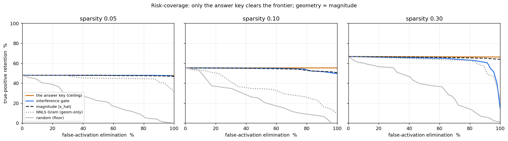

# governance-filter

**An interference gate for neural-network superposition — a selective-prediction filter (classification with a reject option) with a dissent route, studied honestly on a risk-coverage curve.**

> **v3 note.** Earlier versions framed this as a "three-substrate architecture for hallucination elimination" that "eliminates 100% of false activations." That headline does not survive its own benchmark and has been retired. What is kept is a small, real thing: a signal/interference decomposition, a route that preserves the interference residual instead of deleting it, and an honest negative result about what weight geometry can and cannot do. See [What changed in v3](#what-changed-in-v3).

---

## The result, up front (brick first)

In the Elhage et al. (2022) toy model of superposition, a tied-weight linear decode produces *false activations* — features that read as present when their input was absent, because feature directions interfere. The gate scores each output feature by the fraction of its reconstruction **not** explained by that feature's own input-supported term, and rejects (or routes) the interference-dominated ones.

The honest way to score a reject-option method is a **risk-coverage curve**: true-positive retention (coverage) against false-activation elimination (risk removed), swept over the threshold. Elimination alone is a weak scoreboard — a false activation is rare, so even *random* suppression reaches high elimination at ruinous retention (the grey floor in the figure below).



Reproduce it:

```bash
pip install -e ".[dev]"
python -m governance_filter.benchmark            # prints the table
python -m governance_filter.benchmark --figure docs/risk_coverage.png
```

Two things the curve shows, at matched elimination:

1. **Only the answer key clears the frontier.** A trivial rule — *zero a feature iff its true input is below the activation threshold* — reaches 100% elimination at the retention ceiling. It dominates the gate because it **is** the label (see the scope note). The gate cannot beat it, and shouldn't be claimed to.
2. **The weight geometry adds ~nothing over activation magnitude.** At matched elimination the interference gate ties a plain `|x_hat|` magnitude threshold at sparsity 0.05 and 0.10, and is slightly beaten by it at 0.30. A geometry-only NNLS Gram-consistency detector does worse than magnitude. **In this toy model (n=20 features, d=5 dims, sparsities 0.05/0.10/0.30), the weight geometry carries no discriminative signal beyond "how big is the activation."** That is the scope of the claim — a negative result, reported plainly, and the scientifically useful part. (Whether it generalizes past this toy is open.)

## Scope — read this before using it

The gate's score consumes `x_input` (the input feature vector). In the benchmark a false activation is *defined* by `x_input_k ≤ activation_threshold`, so the score reads a monotone function of the label. **This makes the gate a reconstruction auditor given the input, not an inference-time hallucination detector** — at real inference the intended feature vector is not available as an answer key. Benchmarked against baselines that share that access, the geometry earns nothing extra. Use it as a study of the decomposition and the route, not as a deployable hallucination filter.

## What is actually kept: the decomposition and the dissent route

Per output feature `k`, decompose the reconstruction into an input-supported diagonal term and the interference residual:

```
signal_k        = x_input_k * ||w_k||^2            # supported (diagonal)
interference_k  = sum_{j != k} x_input_j * <w_j, w_k>
ratio_k         = |x_hat_k - signal_k| / (|x_hat_k| + eps)   # the reject score
```

Three operating modes, one scalar threshold, no retraining:

- **`filter`** — suppress: zero the routed features.
- **`project`** — recover the clipped input-supported signal instead of zeroing. (Corrected: `project` does **not** strictly dominate `filter` — it can keep a false activation that `filter` removes when `||w_k||^2 > 1`; parity holds only at unit-scale weights. See the docstring and test.)
- **`route`** — the **dissent 2nd-wire**: decompose `x_hat = governed + dissent` exactly. The interference-dominated part is returned on a second wire as an auditable reject channel, not discarded.

```python
import numpy as np
from governance_filter import InterferenceGate

W = np.random.standard_normal((20, 5))     # 20 features in 5 dims
gate = InterferenceGate(W, threshold=0.3)  # threshold = one point on a curve

x_input = ...   # input feature activations
x_hat   = ...   # reconstruction from the decode pass

r = gate.route(x_input, x_hat)
r.governed      # the asserted output
r.dissent       # the residual it declined to assert (governed + dissent == x_hat)
r.routed        # boolean mask of the rejected features
```

The dissent wire is the one design choice here worth keeping. `governed + dissent == x_hat` holds **by construction** — `dissent` is *defined* as the remainder — so the identity is bookkeeping, not a discovery. The point is what the bookkeeping enables: the interference-dominated residual is **returned** on a second wire for audit or re-processing instead of discarded, which `filter`/`project` (and the scheduler's dropped tensors) do not do.

## What changed in v3

- **Retired** the "three-substrate / same governance equation / hallucination elimination" framing. It bundled three unrelated mechanisms and made an unsupportable headline.
- **Renamed** `GovernanceFilter` → `InterferenceGate` (a deprecated alias remains for one release). The generic "governance" umbrella is dropped in favour of naming the specific operation.
- **Moved to `examples/`** the demand-routing table (`typed_routing_demo.py`) and the softmax-confidence utilities (`selective_prediction_demo.py`, formerly `chamber.py` with a scattering-amplitude gloss over a `top1 − top2` margin). They are ordinary, separately-named things — kept as demos of the same *pattern*, not as co-equal substrates.
- **Added** `baselines.py` (trivial-oracle, magnitude, random, NNLS Gram) and reframed `benchmark.py` around the risk-coverage curve.
- **Added** the dissent `route`, a spectral `stable_rank` diagnostic, an `n_features = 1` guard (was a crash), and tests for the gradient, the crash, the `project` non-dominance, and the route's conservation.

## Field placement (so a reader can locate it fast)

| this repo | field-native name | see |
|---|---|---|
| the reject-option gate | selective prediction / classification with a reject option | El-Yaniv & Wiener 2010; Geifman & El-Yaniv 2017 |
| elim vs retention | risk-coverage curve | Chow 1970 |
| the substrate | toy models of superposition | Elhage et al. 2022 |
| `stable_rank` / gap ratio | Gram spectral summary | (⚠ not a "governance-need" predictor — see docstring) |
| the `examples/` softmax utils | max-softmax-prob / margin sampling | Hendrycks & Gimpel 2017; Scheffer 2001 |

## Falsification

The v1 criterion ("eliminate ≥95% of false activations") is withdrawn as ill-posed (elimination alone is gameable). The v3 claims, each falsifiable:

1. On the toy model, the interference gate does **not** exceed a magnitude-threshold baseline in retention at matched elimination. *Falsify by* a benchmark where it clearly does.
2. Geometry-only detection (`score_nnls_gram`, no `x_input`) does **not** beat magnitude. *Falsify by* a geometry-only score that does.
3. `route` conserves the reconstruction (`governed + dissent == x_hat`). *Falsify by* a counterexample (there is a unit test).

We propose, we do not prove.

## Companion

A structurally-related tool at a different substrate — a classification-gated graph scheduler — lives at [`i-nterpret/governor-scheduler`](https://github.com/i-nterpret/governor-scheduler). The two share a *pattern* (classify → partition → route, with a reject/deferred channel), not a shared equation. Cross-cited as companions, nothing more.

## License / citation

Apache 2.0. Synthesis paper: Dunn, J.E. (2026), *Governance Across Substrates*, [10.5281/zenodo.20292282](https://doi.org/10.5281/zenodo.20292282).

```bibtex
@misc{dunn2026interferencegate,
  author = {Dunn, James E.},
  title  = {governance-filter: an interference gate for neural-network superposition},
  year   = {2026},
  note   = {Reference implementation. Apache 2.0. github.com/i-nterpret/governance-filter},
}
```

---

**Author:** James E. Dunn — Independent Researcher · **ORCID:** [0009-0005-2679-6574](https://orcid.org/0009-0005-2679-6574) · **Site:** [i-nterpret.com](https://i-nterpret.com)
